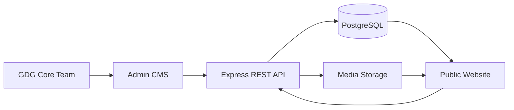
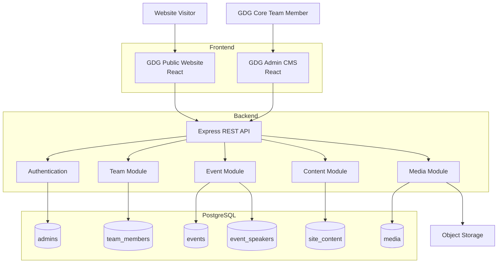
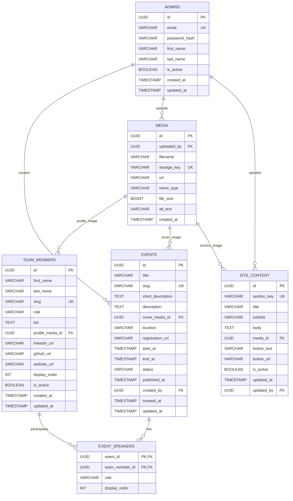
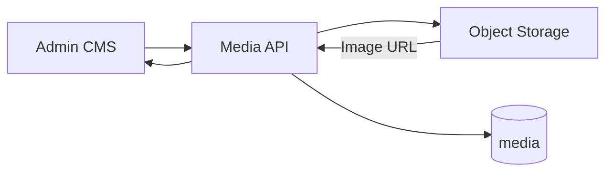
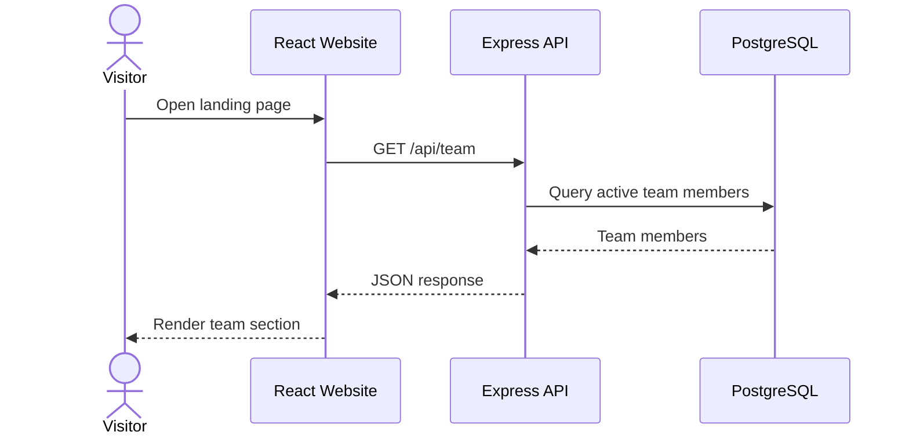
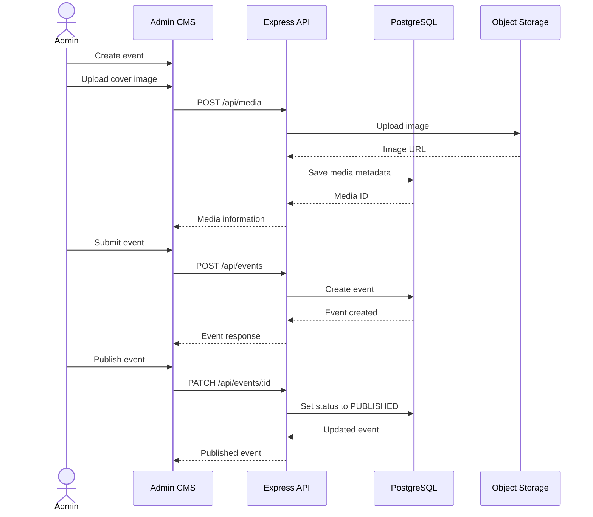
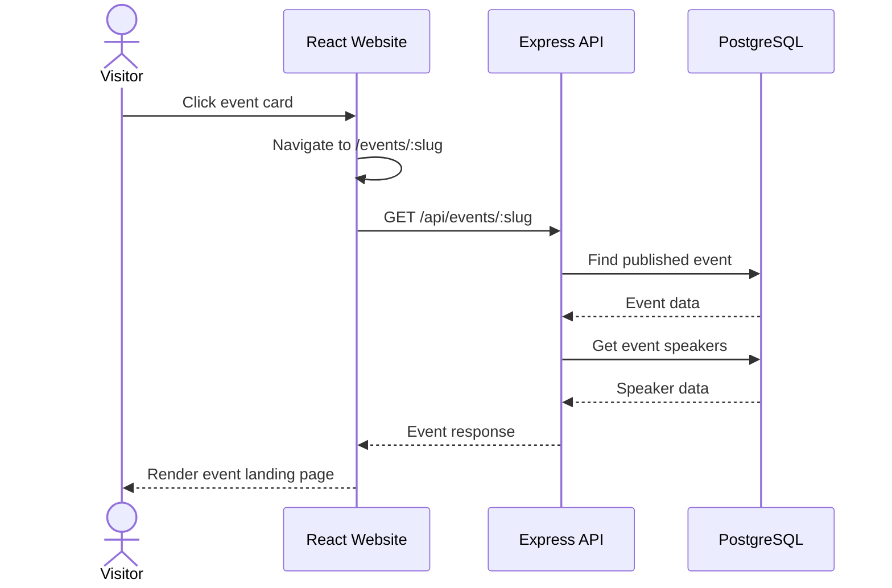
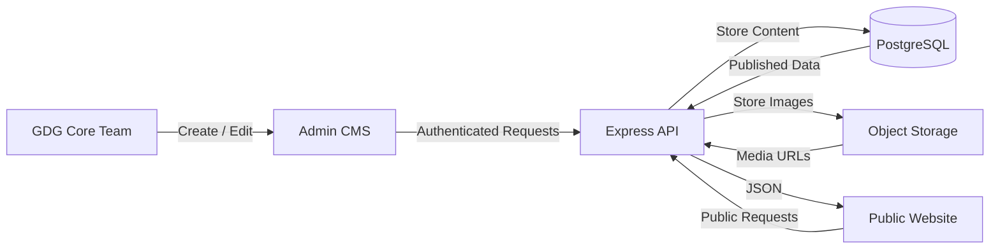

# GDG Website Backend Architecture

## 1. Project Overview

The GDG website will transition from a static landing page into a dynamic content-managed website.

The primary goal is to allow authorized GDG Core Team members to manage website content through a centralized CMS without requiring changes to the frontend codebase for routine content updates.

The backend will provide a REST API that acts as the single source of truth for the public website and the CMS.

### Core capabilities

The backend will support:

- Authentication for GDG Core Team members.
- Core Team member profile management.
- Event creation, editing, publishing, and removal.
- Dedicated public event pages generated dynamically from event data.
- Website content management for editable landing-page sections.
- Media upload and management.
- Public API endpoints for the website.
- Protected CMS API endpoints for administrative operations.

---

# 2. Technology Stack

| Layer             | Technology                            |
| ----------------- | ------------------------------------- |
| Runtime           | Node.js                               |
| Backend Framework | Express.js                            |
| Language          | TypeScript                            |
| Database          | PostgreSQL                            |
| ORM               | Drizzle ORM                           |
| Validation        | Zod                                   |
| API Style         | REST                                  |
| Authentication    | Session or token-based authentication |
| Media Storage     | Object Storage                        |
| Public Frontend   | React                                 |
| Admin CMS         | React                                 |

---

# 3. Architectural Goal

The architecture follows a simple principle:

> **The CMS writes content. The public website reads content.**

The backend sits between the CMS, public website, PostgreSQL database, and media storage.



The frontend should not contain hardcoded organizational data that administrators need to change regularly.

For example, the following should come from the backend:

- Current Core Team members.
- Team member roles.
- Event information.
- Event images.
- Event registration links.
- Hero text.
- About section content.
- Community CTA content.
- Other configurable landing-page content.

---

# 4. System Architecture



---

# 5. Architecture Principles

## 5.1 Centralized Content

The PostgreSQL database is the source of truth for website content.

The public website should not hardcode data such as:

```text
Team member names
Team member roles
Event titles
Event descriptions
Event dates
Registration URLs
Landing page copy
```

Instead, it requests this data through the REST API.

---

## 5.2 CMS Controls Content, Not UI Structure

The CMS should control content.

The React application should control presentation.

### Backend/CMS controls

- Text.
- Images.
- Links.
- Dates.
- Team members.
- Events.
- Publishing status.
- Display order.

### Frontend code controls

- Layout.
- Components.
- Typography.
- Responsive behavior.
- Animations.
- Styling.
- Routing.
- User interactions.

This prevents the project from becoming an unnecessarily complex page-builder system.

---

# 6. Database Architecture

The initial database will contain six primary tables:

```text
admins
team_members
events
event_speakers
media
site_content
```

## Entity Relationship



---

# 7. Entity Responsibilities

## 7.1 Admins

The `admins` table contains the GDG Core Team members who are allowed to access the CMS.

There is intentionally no role and permission system in the initial architecture.

If an account exists in `admins` and is active, that account can access the CMS.

This keeps authentication and authorization simple for the initial project scope.

### Responsibilities

- Authenticate into the CMS.
- Manage Core Team members.
- Manage events.
- Manage website content.
- Upload media.

---

# 8. Team Member Management

The `team_members` table represents the current and previous GDG Core Team profiles that the website can display.

A team member can contain:

- Name.
- Role.
- Bio.
- Profile image.
- LinkedIn.
- GitHub.
- Personal website.
- Display order.
- Active status.

The public website can request:

```http
GET /api/team
```

The CMS can perform:

```http
GET    /api/team
GET    /api/team/:id
POST   /api/team
PATCH  /api/team/:id
DELETE /api/team/:id
```

### Public behavior

Only active team members should be returned by the public API.

The CMS can still manage inactive members.

This allows the organization to preserve profiles without displaying them publicly.

---

# 9. Event Management

Events are a primary content type.

An event can contain:

- Title.
- Slug.
- Short description.
- Full description.
- Cover image.
- Location.
- Registration URL.
- Start date and time.
- End date and time.
- Status.
- Speakers.
- Publishing date.

## Event Status

The initial event status can be:

```text
DRAFT
PUBLISHED
CANCELLED
COMPLETED
```

No separate status table is required at this stage.

---

# 10. Dynamic Event Pages

Each event has a unique slug.

Example:

```text
/events/devfest-cebu-2026
/events/cloud-study-jam
/events/build-with-ai
```

The React application should use a single event-page template:

```text
/events/:slug
```

The page requests:

```http
GET /api/events/:slug
```

The backend returns the event data.

The frontend then renders the event page dynamically.

This means creating a new event does not require creating a new React page.

---

# 11. Event Speakers

The `event_speakers` table connects team members to events.

This creates a many-to-many relationship:

```text
Team Member
     │
     ├── Event A
     ├── Event B
     └── Event C
```

and:

```text
Event
     │
     ├── Speaker A
     ├── Speaker B
     └── Speaker C
```

The junction table also provides:

- Speaker role.
- Display order.

This avoids storing multiple speaker columns directly inside the `events` table.

---

# 12. Media Management

Images should not be stored directly inside PostgreSQL.

The system should use object storage for the actual files.

The database stores metadata and references.



Example flow:

```text
Admin uploads image
        ↓
Express API
        ↓
Object Storage
        ↓
Storage URL
        ↓
media record in PostgreSQL
        ↓
URL returned to CMS
```

The `media` table can store:

- Filename.
- Storage key.
- URL.
- MIME type.
- File size.
- Alt text.
- Uploader.
- Creation timestamp.

---

# 13. Website Content Management

The `site_content` table handles editable landing-page content.

Example records:

```text
hero
about
community
cta
footer
```

Example:

```text
section_key:
hero

title:
Build. Learn. Connect.

subtitle:
Join the GDG community in Cebu.

button_text:
Join the Community

button_url:
https://...
```

Another record:

```text
section_key:
about

title:
About GDG Cebu

body:
Google Developer Groups Cebu is a community...
```

The React frontend can map the section keys to predefined components.

```text
hero       → HeroSection
about      → AboutSection
community  → CommunitySection
cta        → CTASection
footer     → Footer
```

The CMS changes the content.

The frontend code controls the layout.

---

# 14. API Architecture

The REST API should be organized by domain.

```text
/api
│
├── /auth
│   ├── POST /login
│   ├── POST /logout
│   └── GET  /me
│
├── /team
│   ├── GET    /
│   ├── GET    /:id
│   ├── POST   /
│   ├── PATCH  /:id
│   └── DELETE /:id
│
├── /events
│   ├── GET    /
│   ├── GET    /upcoming
│   ├── GET    /past
│   ├── GET    /:slug
│   ├── POST   /
│   ├── PATCH  /:id
│   └── DELETE /:id
│
├── /content
│   ├── GET    /
│   ├── GET    /:sectionKey
│   ├── POST   /
│   └── PATCH  /:sectionKey
│
└── /media
    ├── POST   /upload
    ├── GET    /
    └── DELETE /:id
```

---

# 15. Backend Module Structure

The backend should follow a modular architecture.

```text
src/
│
├── config/
│   ├── env.ts
│   └── database.ts
│
├── middleware/
│   ├── auth.ts
│   ├── validation.ts
│   └── error-handler.ts
│
├── modules/
│   │
│   ├── auth/
│   │   ├── auth.controller.ts
│   │   ├── auth.service.ts
│   │   ├── auth.routes.ts
│   │   ├── auth.schema.ts
│   │   └── auth.queries.ts
│   │
│   ├── admins/
│   │   ├── admin.ts
│   │   ├── admin.controller.ts
│   │   ├── admin.service.ts
│   │   ├── admin.routes.ts
│   │   ├── admin.schema.ts
│   │   └── admin.queries.ts
│   │
│   ├── team-members/
│   │   ├── team-member.ts
│   │   ├── team-member.controller.ts
│   │   ├── team-member.service.ts
│   │   ├── team-member.routes.ts
│   │   ├── team-member.schema.ts
│   │   └── team-member.queries.ts
│   │
│   ├── events/
│   │   ├── event.ts
│   │   ├── event.controller.ts
│   │   ├── event.service.ts
│   │   ├── event.routes.ts
│   │   ├── event.schema.ts
│   │   └── event.queries.ts
│   │
│   ├── event-speakers/
│   │   ├── event-speaker.ts
│   │   ├── event-speaker.controller.ts
│   │   ├── event-speaker.service.ts
│   │   ├── event-speaker.routes.ts
│   │   ├── event-speaker.schema.ts
│   │   └── event-speaker.queries.ts
│   │
│   ├── media/
│   │   ├── media.ts
│   │   ├── media.controller.ts
│   │   ├── media.service.ts
│   │   ├── media.routes.ts
│   │   ├── media.schema.ts
│   │   └── media.queries.ts
│   │
│   └── site-content/
│       ├── site-content.ts
│       ├── site-content.controller.ts
│       ├── site-content.service.ts
│       ├── site-content.routes.ts
│       ├── site-content.schema.ts
│       └── site-content.queries.ts
│
├── db/
│   ├── schema/
│   ├── migrations/
│   └── seed.ts
│
├── app.ts
└── server.ts
```

---

# 16. Request Flow

## Public Team Request



## Admin Event Creation



---

# 17. Public Event Page Flow



---

# 18. Authentication Model

The initial authentication model is intentionally simple.

There are no:

- Roles.
- Permission tables.
- Role-permission relationships.
- Complex authorization policies.

Instead:

```text
Request
   ↓
Authentication Middleware
   ↓
Is the user authenticated?
   │
   ├── No → 401 Unauthorized
   │
   └── Yes → Continue
```

Only active records in `admins` can access CMS operations.

This is sufficient while the CMS is exclusively intended for the GDG Core Team.

A role-based system can be introduced later if the organization grows and different access levels become necessary.

---

# 19. Public vs Protected API

## Public endpoints

These endpoints do not require authentication:

```text
GET /api/team
GET /api/events
GET /api/events/upcoming
GET /api/events/past
GET /api/events/:slug
GET /api/content
GET /api/content/:sectionKey
```

Only publicly safe fields should be returned.

For example, the public team response must never expose:

```text
password_hash
admin account information
internal database identifiers where unnecessary
private metadata
```

## Protected endpoints

These require an authenticated Core Team member:

```text
POST   /api/team
PATCH  /api/team/:id
DELETE /api/team/:id

POST   /api/events
PATCH  /api/events/:id
DELETE /api/events/:id

POST   /api/content
PATCH  /api/content/:sectionKey

POST   /api/media
DELETE /api/media/:id
```

---

# 20. Data Flow

The overall content flow is:



---

# 21. MVP Scope

The first implementation should focus only on:

## Authentication

- Admin login.
- Admin logout.
- Authenticated CMS sessions/tokens.
- Active admin check.

## Core Team

- Create member.
- Edit member.
- Delete/deactivate member.
- Upload profile image.
- Manage social links.
- Set display order.

## Events

- Create event.
- Edit event.
- Delete event.
- Draft event.
- Publish event.
- Cancel event.
- Mark event completed.
- Upload cover image.
- Add team-member speakers.
- Add registration URL.
- Set date and time.
- Set location.

## Website Content

- Edit hero.
- Edit About section.
- Edit community section.
- Edit CTA.
- Edit footer content.
- Change section images.
- Change links and button text.

## Media

- Upload images.
- Store media metadata.
- Reference uploaded media from content entities.

---

# 22. Deliberately Out of Scope

The first version should not include:

- Complex RBAC.
- Permission management.
- Event registration management.
- Attendance tracking.
- Payment processing.
- Newsletter management.
- Email marketing.
- Analytics.
- Content versioning.
- Page-builder functionality.
- Drag-and-drop page layouts.
- Multiple organizations.
- Multi-tenancy.
- Complex workflow approvals.

These can be added later if actual requirements justify them.

---

# 23. Future Extensions

The architecture leaves room for future features.

Possible additions include:

```text
Event Registrations
Event Categories
Event Galleries
Independent Speakers
Event Organizers
Announcements
Newsletter
Analytics
Audit Logs
Content Versioning
Scheduled Publishing
RBAC
```

These should be added only when they solve an actual requirement.

---

# 24. Final Architecture

The final MVP architecture can be summarized as:

```text
                    GDG CORE TEAM
                          │
                          ▼
                    ADMIN CMS
                          │
                          ▼
                  EXPRESS REST API
                          │
              ┌───────────┴───────────┐
              │                       │
              ▼                       ▼
        POSTGRESQL              OBJECT STORAGE
              │                       │
              └───────────┬───────────┘
                          │
                          ▼
                   PUBLIC WEBSITE
```

The six primary database entities are:

```text
admins
team_members
events
event_speakers
media
site_content
```

The design intentionally keeps the backend small and focused.

The CMS manages the data that changes frequently.

The frontend owns the presentation.

The API provides the boundary between them.

PostgreSQL provides persistent structured data.

Object storage provides media storage.

This architecture is sufficient to transform the existing static GDG landing page into a maintainable, database-driven website without introducing unnecessary CMS complexity.
